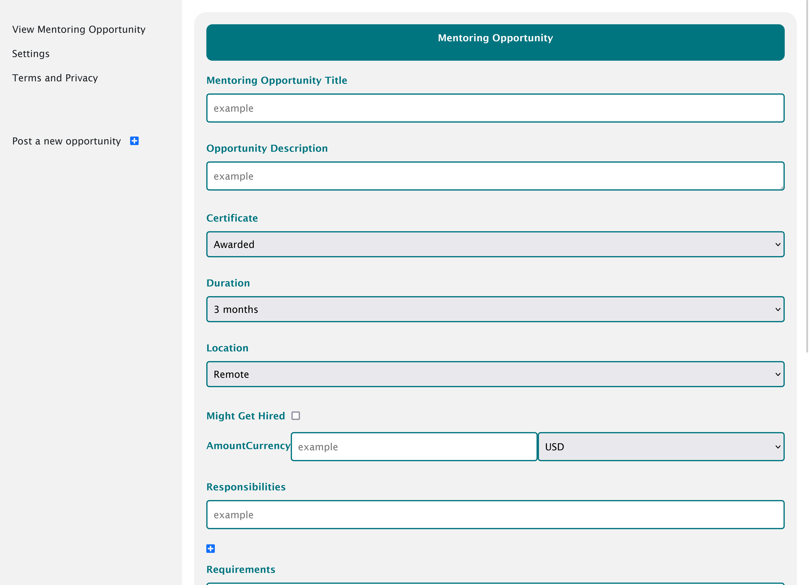

# Mentoring Opportunity Form

This project is a responsive web application for managing mentoring opportunities. It allows users to create, view, and manage opportunities with relevant details.

  <!-- Replace with the actual path or URL of the image -->

## Table of Contents

- [Features](#features)
- [Technologies Used](#technologies-used)
- [Getting Started](#getting-started)
- [Usage](#usage)
- [Contributing](#contributing)
- [License](#license)

## Features

- Responsive layout that adjusts for various screen sizes
- User-friendly form for submitting mentoring opportunities
- Option to specify details such as title, description, duration, location, and requirements
- Footer with navigation links and social media icons

## Technologies Used

- HTML5
- CSS3 (with Flexbox for responsive design)
- Font Awesome for icons
- Bootstrap for additional styling (optional)

## Getting Started

To get a local copy up and running follow these simple steps.

### Prerequisites

- A modern web browser (Chrome, Firefox, Safari, etc.)
- A text editor (VS Code, Sublime Text, etc.)

### Installation

1. Clone the repository:
   ```bash
   git clone https://github.com/your-username/mentoring-opportunity-form.git
